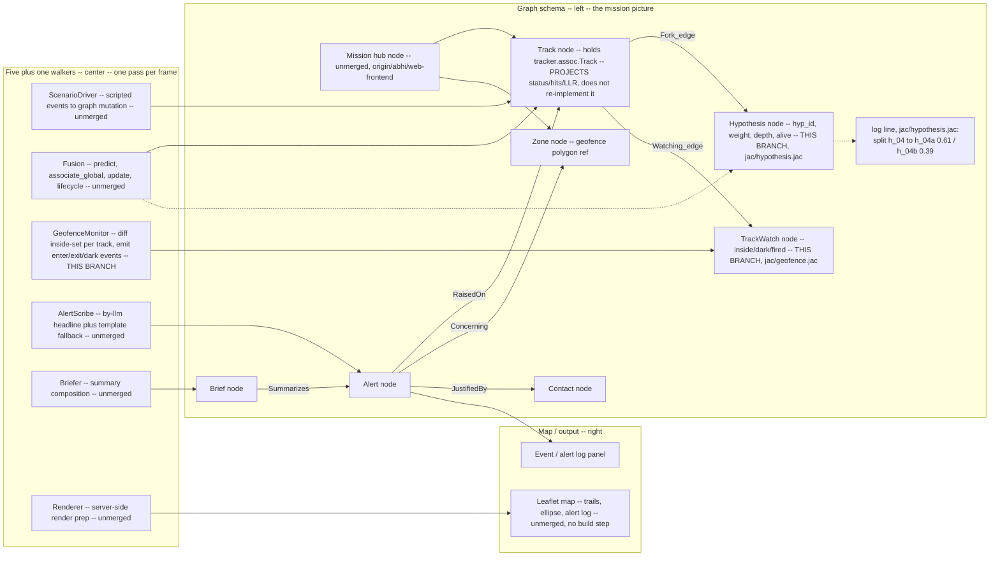

# Architecture diagram -- build spec

A specification for redrawing this in Excalidraw, not a substitute image. Two
representations of the same layout: a Mermaid diagram (renders on GitHub) and a
box-by-box description with positions, so anyone with Excalidraw open can
reproduce it without improvising.

**Branch note, read first**: this repo's Jac code is currently split across
branches that have not merged. `phase-1-kalman` (this branch) has the
hypothesis lifecycle, geofence transition tracking, and the contracts/eval/
fences orchestration port. `origin/abhi/web-frontend` (unmerged) has the live
per-frame pipeline: `graph.jac`, `driver.jac`, `fusion.jac`, `alerts.jac`,
`render.jac`, `main.jac`. The diagram below shows the **combined, intended**
picture and marks every box with which branch it actually lives on today.

**Walker-name correction**: an earlier plan named the five center walkers as
`Fusion`, `TrackWalker`, `AnomalyDetector`, `GeofenceMonitor`, `ThreatScorer`.
Checked directly against source (`jac/hypothesis.jac`, `jac/geofence.jac`,
`origin/abhi/web-frontend:jac/*.jac`): `Fusion` and `GeofenceMonitor` are real.
`TrackWalker`, `AnomalyDetector`, and `ThreatScorer` **do not exist in any
branch's source**. The real five-walker roster spanning both branches is
`ScenarioDriver`, `Fusion`, `AlertScribe`, `Renderer` (all `origin/abhi/
web-frontend`, unmerged) plus `GeofenceMonitor` (this branch). `Briefer`
(summary composition) is a sixth walker on `origin/abhi/web-frontend` not in
the original five-name list. The hypothesis fork itself is not a per-frame
walker at all -- it's two traversal walkers, `LiveLeaves` and `BranchRoot`
(`jac/hypothesis.jac`), invoked from `maintain()`.

## Mermaid



## Box-by-box layout (for Excalidraw)

**Canvas**: three vertical lanes, left third / center third / right third,
left-to-right data flow with arrows crossing lane boundaries only rightward
except the one explicit "fork" branch arrow noted below.

### Left lane -- Graph schema

- **Mission** (top box, hub) -- one box, labeled "Mission (hub node) -- unmerged
 (`jac/graph.jac`)". All other left-lane nodes hang off it.
- **Track** node, directly under Mission. Contents: "holds `tracker.assoc.Track`
 (Kalman + lifecycle); PROJECTS status/hits/LLR, does not duplicate the state
 machine." Note under the box: unmerged.
- **Zone** node, right of Track, same row. Contents: "geofence polygon
 reference, kind (mpa/cable/port/danger/land)."
- **Hypothesis** node, below Track, connected by a **Fork edge** (label the
 arrow "Fork"). Contents: "hyp_id, weight, depth, alive, parent_id,
 prune_reason." Note: **THIS BRANCH** (`jac/hypothesis.jac`).
- **TrackWatch** node, below Zone, connected to Track by a **Watching edge**.
 Contents: "inside (sorted fence ids), dark (bool), fired (set) -- per-track
 memory." Note: **THIS BRANCH** (`jac/geofence.jac`).
- **Alert** node, bottom-left. Edges in: **RaisedOn** from Track, **Concerning**
 from Zone, **JustifiedBy** from Contact (small box, far bottom-left).
- **Brief** node, bottom, **Summarizes** edge from Alert.

### Center lane -- five walkers, stacked top to bottom in per-frame execution order

1. **ScenarioDriver** -- "scripted events (ais_off, radar_contact,
 identity_change) as graph mutations." Unmerged.
2. **Fusion** -- "predict -> associate_global -> update Track nodes ->
 lifecycle (tentative/active/coasting/dropped) -> zone transitions." Unmerged.
 Draw a **branching arrow down-and-out to the Hypothesis node in the left
 lane**, labeled "ambiguity margin < 2 nats -> fork" -- this is the one arrow
 that crosses right-to-left, and it should visually look like a fork/split
 (a Y-shape), not a straight line, to make the branching literal.
3. **GeofenceMonitor** -- "diffs this-frame containment against `inside`/`dark`/
 `fired`; emits enter/exit/ais_dark/dark_inside_protected_area/ais_resume."
 **THIS BRANCH.**
4. **AlertScribe** -- "`by llm()` headline, `sem` annotations, fallback chain
 byllm -> litellm -> template; records `model_used`." Unmerged.
5. **Renderer** -- "server-side render prep: ellipse polygons, colors, log
 lines -- frontend computes nothing." Unmerged.

Draw a thin connecting arrow chain top-to-bottom between the five boxes
labeled "one spawn per frame, in this order" -- the ordering is load-bearing
(Fusion must update lifecycle before GeofenceMonitor reads position, etc.).

### Right lane -- Map / output

- **Leaflet map** box, top: "trails, smooth marker motion, capped scrolling
 log; the frontend computes nothing -- every drawn value is a field the
 server already put in the FrameDelta." Unmerged, no build step.
- **Event/alert log panel** box, below: fed from Alert/Brief nodes in the left
 lane via Renderer.

### The hypothesis-fork callout (draw as an inset box near the Fork edge)

Exact verified log format, from `jac/hypothesis.jac`'s own docstring (ASCII
only, `->` not a unicode arrow, so the console doesn't raise
`UnicodeEncodeError` on Windows cp1252):

```
[Hypothesis] split h_04 -> h_04a (0.61) / h_04b (0.39)
[Hypothesis] pruned h_04b
```

Pipeline order inside `maintain()`, worth a small numbered list in the inset:
normalize -> N-scan collapse (depth >= 3) -> weight-floor kill (< 0.01) ->
hard-cap enforce (> 8 live) -> normalize again.

### Legend (bottom of canvas)

- Solid box border = built and tested on the branch named inside it.
- Dashed box border = **PLACEHOLDER** (nothing currently fills this role -- 
 none needed as of this writing; all five walkers and all graph nodes above
 are real, on one branch or another).
- Box label "THIS BRANCH" = present on `phase-1-kalman`.
- Box label "unmerged" = present only on `origin/abhi/web-frontend`, not yet
 merged into `phase-1-kalman`.
